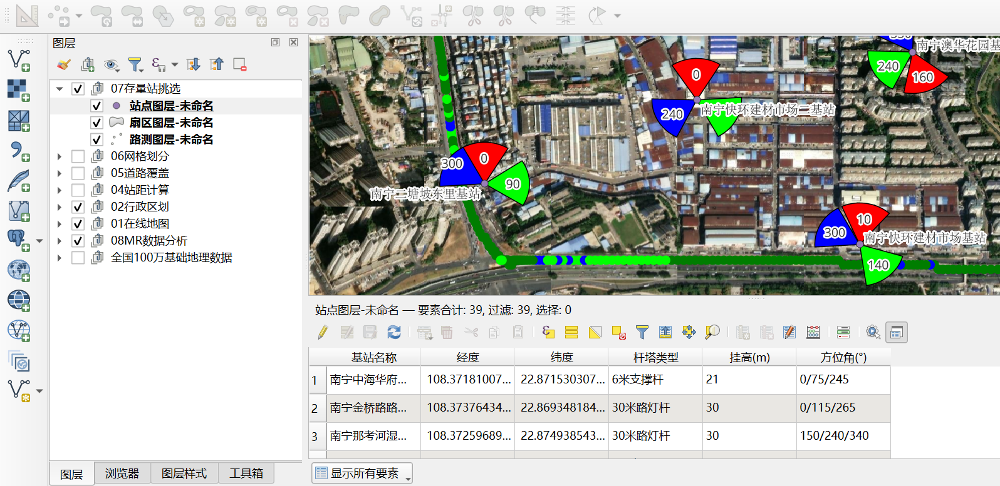

# 通信规划图层生成工具 · PlanLayerCreator

**PlanLayerCreator — Communication Planning GIS Layer Generator**

一款面向通信规划、无线优化和网络维护人员的桌面 GIS 图层生成工具。将 Excel、CSV 或 TXT 数据快速生成站点、扇区、路测、MR 栅格、线路和面域等 GIS 图层，可用于 Google Earth、MapInfo、QGIS、ArcGIS 等软件的浏览、制图与数据交换。

A desktop GIS layer generator for telecom planning, RF optimization, and network maintenance. Convert Excel/CSV/TXT data into GIS layers (sites, sectors, drive tests, MR grids, polylines, polygons) for Google Earth, MapInfo, QGIS, and ArcGIS.

> ⚠️ **界面语言 / UI Language**：本软件界面为**简体中文**（Simplified Chinese only）。英文读者可通过本 README 了解功能与使用方法。
> The application UI is **Simplified Chinese only**. English readers can learn about features and usage from this README.

---

## ✨ 主要功能及特点 / Features

### 图层制作能力 / Layer Types

| 图层 | 用途 | 必需数据 |
|------|------|---------|
| 站点 Site | 按经纬度生成点位，可设图标、标签颜色及大小 | 经度、纬度、站点名称 |
| 扇区 Sector | 按方位角生成扇形面，可设波束宽度、覆盖半径与填充边框 | 经度、纬度、名称、方位角 |
| 路测 Drive Test | 按 RSRP/RSSI 等电平分级显示海量采样点 | 经度、纬度、测量电平 |
| MR 栅格 Grid | 按实际米制网格聚合样本或直接使用已有栅格编号 | 经度、纬度、测量电平 |
| 线路 Line | 解析 LINESTRING/MULTILINESTRING WKT 并设置线型 | WKT 几何列 |
| 面域 Polygon | 解析 POLYGON/MULTIPOLYGON WKT 并设置填充及边框 | WKT 几何列 |

### 重点增强能力 / Key Enhancements

- **原生着色 TAB Native-colored TAB**：点、扇区、线路、面域、路测和栅格的 Symbol、Pen、Brush 样式可直接写入 TAB，不再依赖手工 MIF 转换。
- **中文属性 Chinese Attributes**：TAB 保留中文字段名和中文数据，仅对 MapInfo 不允许的符号或超长字段名做最小调整，并生成字段名对照文件。
- **标签工作空间 Label Workspace**：需要自动标签时同步生成同名 `.wor`，打开即可恢复标签字段、颜色和地图窗口状态。
- **轻量 KML/KMZ Lightweight KML/KMZ**：路测和 MR 栅格仅保留所选电平值，避免完整 Excel 属性在每个对象中重复写入。
- **大数据分片 Tiled Loading**：超大路测 KMZ 自动分区，通过 NetworkLink 按视野加载，降低 Google Earth 首次打开压力。
- **稳定聚合 Stable Aggregation**：MR 原始样本在 UTM 投影中按实际米数聚合，可选平均值或中位数，并过滤样本数不足的网格。
- **坐标纠偏 Coordinate Correction**：GCJ-02 → WGS84 一键纠偏。

## 🖼️ 软件截图 / Screenshots



*更多截图见 [screenshots/](screenshots/) 目录。*

## 📁 支持格式 / Supported Formats

| 图层类型 | KML/KMZ | TAB | SHP | MIF |
|---------|:---:|:---:|:---:|:---:|
| 站点 Site | ✅ 着色 | ✅ 符号 | ✅ | — |
| 扇区 Sector | ✅ 填充 | ✅ Brush/Pen | ✅ | — |
| 路测 Drive Test | ✅ 分级点色 | ✅ 分级 Symbol | ✅ | ✅ |
| MR 栅格 Grid | ✅ 分级面色 | ✅ Brush/Pen | ✅ | ✅ |
| 线路 Line | ✅ 样式 | ✅ Pen | ✅ | — |
| 面域 Polygon | ✅ 填充 | ✅ Brush/Pen | ✅ | — |

**说明 / Notes**：
- TAB 输出为同名文件组（.tab/.dat/.map/.id），须整体交付。
- 安装 MapInfo 时生成兼容旧版（含 2012）的 TAB；无 MapInfo 时用内置运行库生成 MapInfo 15.2+ TAB。
- SHP 标准不存渲染样式，路测/MR 附同名 QML 供 QGIS 使用。

## 🚀 快速开始 / Quick Start

1. 从 [Releases](../../releases) 下载 `PlanLayerCreator.exe`
2. 双击运行（无需安装 Python，支持 Windows 10/11 x64）
3. 选择图层类型 → 导入数据 → 映射字段 → 设置样式 → 生成

### 数据要求 / Data Requirements

- 第一行为字段名称；必须包含**经度列**和**纬度列**
- 栅格/路测图层额外需要**电平值列**（如 RSRP）
- 扇区图层额外需要**方位角列**
- 经纬度须为十进制度数（如 116.397128），不支持度分秒
- 样例数据见 [`data/`](data/) 目录

## 🧪 开发者 / For Developers

```bash
# 创建虚拟环境（须用 CPython，非 conda）
python -m venv .venv
.venv\Scripts\pip install -r requirements-build.txt

# 运行源码自检
set QT_QPA_PLATFORM=offscreen
set PLANLAYER_TAB_BACKEND=gdal
python main.py --self-test test_output

# 构建单文件 EXE
python -m PyInstaller --clean PlanLayerCreator.spec
```

## 🏗️ 技术栈 / Tech Stack

Python 3.12 · PySide6 · pandas · numpy · pyogrio (GDAL) · shapely · pyproj · simplekml

## 📄 许可证 / License

本项目采用 [CC BY-NC 4.0（署名-非商业性使用）](LICENSE) 许可协议。

- ✅ 可自由查看、下载、修改、分享源码
- ✅ 使用时须保留作者署名
- ❌ **禁止商业用途**（销售、集成到收费产品、有偿服务需单独商业授权）

This project is licensed under [CC BY-NC 4.0](LICENSE) (Attribution-NonCommercial). Free for personal/non-commercial use. Commercial use requires a separate license.

## 📞 联系方式 / Contact

- **作者 Author**：通信民工（Jerry Xu）
- **哔哩哔哩 Bilibili**：@通信民工（UID：482597398）
- **微信公众号 WeChat**：@通信民工（ComDesigner）
- **QQ**：853665220（@qq.com）
- **著作 Book**：《5G网络规划与工程实践》（清华大学出版社出版，当当、京东、淘宝等平台均可购买）
